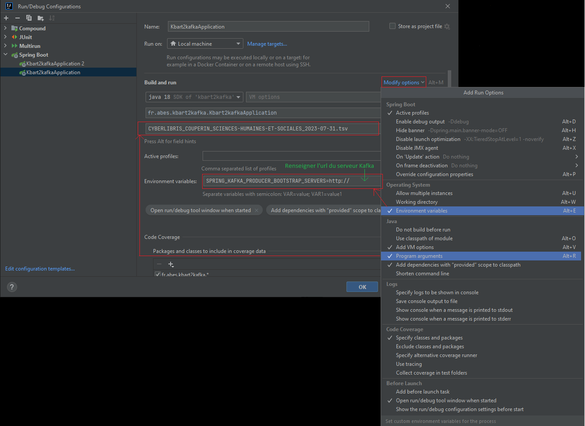

# kbart2kafka-api

Le langage utilisé est Java, avec le framework Spring.

API permettant de lire, contrôler et traiter un fichier kbart de type TSV (Tab-separated values).

## Schéma de l'architecture du projet Convergence


## Lecture du fichier
*(class `Kbart2kafkaApplication.java`)*

L'utilisateur lance le chargement d'un fichier kbart à partir de l'application cercle-bacon.

Les développeurs et développeuses peuvent lancer le chargement d'un fichier kbart :
- via une ligne de commande directement à partir du serveur d'installation de l'API `sudo docker exec kbart2kafka java -jar /app/run/kbart2kafka.jar /app/kbart/SPRINGER_GLOBAL_ALLEBOOKS_2023-05-01.tsv` (vérifier que le container docker soit démarré ainsi que la présence des chemins d'accès et du fichier kbart)
- via un IDE (exemple avec IntelliJ) 

Ces deux derniers types de lancement sont détaillés sur le gitlab de l'Abes (accès sécurisé) : [git.abes.fr](https://git.abes.fr/colodus/convergence-configuration)

Le fichier est passé en paramètre de l'application `public void run(String... args)`

## Contrôle du fichier
*(class `Kbart2kafkaApplication.java` et `CheckFiles.java`)*

Lors du lancement de l'API, celle-ci vérifie qu'un fichier a bien été joint. Le cas échéant, le fichier est chargé.
Le nom du fichier est passé dans le threadContext `ThreadContext.put("package", args[0]);`

Après chargement du fichier, plusieurs données sont vérifiées :
- le format du nom du fichier via une regex `"([a-zA-Z0-9\\-]+_){3}(\\d{4}-\\d{2}-\\d{2})+(_FORCE|_BYPASS)?+(.tsv)$"`
- la présence ou non d'un paramètre _BYPASS et, le cas échéant, l'absence d'une colonne bestPpn dans le fichier
- la présence d'un provider dans le nom du fichier
- l'extension du fichier (.tsv)
- la présence de tabulations sur toutes les lignes du fichier
- la présence d'un header conforme (modèle du header conforme : `kbart.header` dans le fichier application.properties)

Le chargement antérieur d'un fichier kbart plus récent est ensuite contrôlé via le service `ProviderPackageService`. Si tel est le cas, la tentative de chargement échoue.
Ce service `ProviderPackageService` fait appel à une base de données Oracle dont la configuration (`spring.datasource.bacon.jdbcurl` `spring.datasource.bacon.username` `spring.datasource.bacon.password`) doit être complétée dans les fichiers application-dev.properties, application-test.properties, application-prod.properties et application-localhost.properties.
```java
# Base Bacon
spring.datasource.bacon.driver-class-name=oracle.jdbc.OracleDriver
spring.datasource.bacon.jdbcurl=
spring.datasource.bacon.username=
spring.datasource.bacon.password=

spring.jpa.bacon.database-platform=org.hibernate.dialect.OracleDialect
spring.jpa.bacon.properties.hibernate.dialect=org.hibernate.dialect.OracleDialect
spring.jpa.bacon.generate-ddl=false
spring.jpa.bacon.hibernate.ddl-auto=none
spring.jpa.bacon.show-sql=false
spring.sql.bacon.init.mode=never
```

## Traitement du fichier
*(class `FileService.java`)*

>[!NOTE] 
> 
> Le traitement du fichier est en multithread. Le nombre de thread est inscrit dans les fichiers application-dev.properties, application-test.properties, application-prod.properties, application-localhost.properties (`spring.kafka.producer.nbthread`)

Un `ExecutorService` est instancié puis initialisé dans :
```java
@PostConstruct
void initExecutor() {
    executor = Executors.newFixedThreadPool(nbThread);
}
```

Une par une, chaque ligne du fichier est lue puis mappée (méthode `private LigneKbartDto constructDto(String[] line)`) en un objet `LigneKbartDto`, pour être ensuite envoyée dans un topic Kafka (`topicKbart`) pour traitement ultérieur par une application tierce (best-ppn-api : [lien vers la page github du projet best-ppn-api](https://github.com/abes-esr/best-ppn-api) )

L'envoi dans le topic kafka s'effectue en multithread. Le nom du fichier est passé dans la `key` du message kafka. Le numéro de la ligne courante `nbCurrentLines` ainsi que le nombre de ligne total du fichier kbart `nbLinesTotal` sont passés dans le header du message kafka. 

En cas de problème sur la lecture ou l'envoi d'une ligne du fichier kbart, un message d'erreur est envoyé sur un topic Kafka (`topicErrors`) pour un traitement ultérieur par une application tierce (logskbart-api : [lien vers la page github du projet logskbart-api](https://github.com/abes-esr/logskbart-api) )  
Une fois le fichier traité, l'API s'arrête. 

Les valeurs attribuées aux paramètres `topicKbart` et `topicErrors` sont inscrits dans le fichier application.properties
```java
topic.name.target.kbart=bacon.kbart.toload
topic.name.target.errors=bacon.kbart.toload.errors
```
>[!IMPORTANT] 
> 
> Le topic Kafka `bacon.kbart.toload` doit être créé avec un nombre de partitions équivalent au nombre de thread de l'API.
